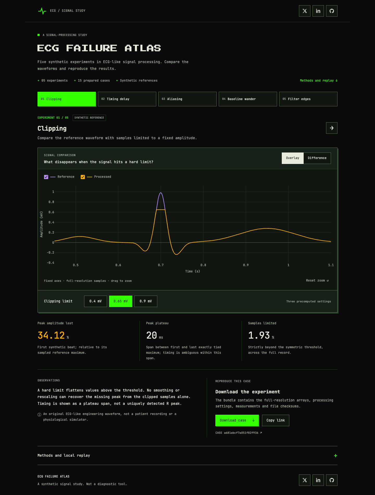

# ECG Failure Atlas

**Five controlled experiments in ECG-like signal processing.**

Five interactive experiments expose clipping, timing delay, aliasing, baseline-filter tradeoffs and filter-edge effects. Each setting comes with full-resolution arrays, measurements, a permanent configuration/input ID, and a replay bundle.

Built for **Apple Silicon macOS**, with a static gallery that can be hosted on GitHub Pages. Python computes every result; the browser selects and displays prepared experiments. The demo uses synthetic references and runs without a backend.



## Try the gallery

[Open the demo](https://zakimaths.github.io/ecg-failure-atlas/) · [Watch the recording](docs/assets/ecg-failure-atlas-demo.mp4)

Open **[gallery/index.html](gallery/index.html)** from your downloaded copy of the repository in a browser. All chart assets and data are included locally. Or serve it from the repository root:

```sh
python3 -m http.server 8765 --bind 127.0.0.1 --directory gallery
```

Visit **http://127.0.0.1:8765**. Choose a case, change one of its three prepared settings, switch between Overlay and Difference, and download the exact result. Links retain the selected case and setting. Use the hosted demo link when sharing a case; `localhost` and `file:` links only work on your machine.

## Reproduce on an Apple Silicon Mac

Use a native Terminal session (`uname -m` should print `arm64`). Install [uv](https://docs.astral.sh/uv/getting-started/installation/) if needed; this project was tested with **uv 0.9.17**. A version-specific installer is available:

```sh
curl -LsSf https://astral.sh/uv/0.9.17/install.sh -o /tmp/ecg-uv-install.sh
# Inspect the downloaded installer, then run it:
sh /tmp/ecg-uv-install.sh
```

Restart your terminal if uv is not yet on PATH. From the repository root:

```sh
uv sync --locked
uv run --locked pytest -q
uv run --locked ecg-atlas build recipes/demo.json --out build/my-demo
uv run --locked ecg-atlas verify build/my-demo
uv run --locked ecg-atlas replay build/my-demo --mode saved-input
uv run --locked ecg-atlas replay build/my-demo --mode regenerate
uv run --locked ecg-atlas export-gallery build/my-demo --out build/my-gallery
```

The Python patch is pinned to **3.12.12** in `.python-version`; uv can install it automatically. NumPy, SciPy, Plotly, test dependencies and artifact hashes are in `uv.lock`. First installation needs network access; calculations and gallery viewing work offline afterward.

Use a **fresh output directory** for each build/export. Existing evidence is never overwritten by the CLI. To replay a downloaded ZIP, extract it into a new folder and use that folder instead of `build/my-demo` in the verify/replay commands.

## Optional browser automation

The gallery needs no JavaScript build step. Node is used only for repeatable browser checks and recording. `.node-version` records the tested Node version; `package-lock.json` locks the CLI and its browser engine dependencies.

```sh
npm ci --ignore-scripts
npx --no-install playwright-cli install-browser webkit
npm run check:browser
```

The default check uses installed Chrome and Playwright WebKit. Run `npm run check:browser -- webkit` for WebKit alone. The runner starts and closes its own localhost server, checks all 15 settings against their saved samples and measurements, and writes results/screenshots under `output/playwright/`. It also checks keyboard controls, downloads, clipboard denial, narrow charts and offline viewing. Browser installation needs network access.

Check the shipped gallery's complete evidence chain without a browser:

```sh
uv run --locked python scripts/verify-gallery.py gallery
```

See the verification record for which automated checks have actually completed. To record the scripted demonstration after those checks pass, use `npm run record:demo`.

## The five experiments

| Case | What to inspect | Independent check |
|---|---|---|
| Clipping | Lost peak amplitude and ambiguous plateau timing | Literal expected clipped array |
| Timing delay | Same shape, later landmark | Five samples at 500 Hz = 10 ms; no wraparound |
| Aliasing | 80 Hz input becomes a signed 20 Hz alias | Negative 20 Hz analytic sine; interior FIR suppression |
| Baseline wander | Drift removal also changes the clean signal | Separate clean-input and corrupted-input branches |
| Filter edges | Crop-then-filter differs from filter-then-crop | Explicit boundary windows; analytic forward/backward gain test |

The generator is an original simplified ECG-like waveform, plus a pure sine probe. The project is an engineering demonstration, **not a diagnostic tool or clinically validated benchmark**. There is no disease classifier whose accuracy is being measured.

## Experiment structure

- **One calculation engine:** Python/NumPy/SciPy; no duplicated browser filters.
- **15 saved settings:** three per experiment, with fixed axes and full-resolution metrics.
- **Replay bundles:** inputs, outputs, intermediate branches, events, configuration, coefficients, metrics, environment and SHA-256 checksums.
- **Separate checks:** payload integrity, saved-input recalculation, and full regeneration. A checksum is not proof of scientific correctness or authorship.
- **Source provenance:** Python source fingerprint and git revision when available. Hosted bundles are rebuilt from the deployed commit. Each download records its source revision and fingerprint.

The static gallery is about 10 MB uncompressed including all 15 ZIP downloads and the local Plotly bundle. It loads no remote fonts or application services. This is intentionally small enough to understand without a framework.

## Tests and project status

See **[the verification record](docs/verification.md)** for observed results and remaining release checks. The native Mac verification workflow is in `.github/workflows/verify.yml`; a workflow file alone is not a passing GitHub Actions run.

```sh
uv run --locked ruff check src tests
uv run --locked ruff format --check src tests
```

The public gallery supports prepared settings. For custom research experiments, use the Python functions in `reference.py`, `transforms.py` and `metrics.py`; expand recipes and tests deliberately. General patient-data upload, arbitrary browser filtering, detector scoring and Intel support are outside this version.

## Repository guide

- `src/ecg_atlas/`: numeric engine, bundle validation, CLI and gallery source.
- `recipes/demo.json`: the 15 prepared experiments.
- `tests/`: independent numeric oracles, replay and export checks.
- `gallery/`: generated static site and self-contained downloads.
- [Methodology](docs/methodology.md), [reproducibility](docs/reproducibility.md), [sources](docs/sources.md).
- [Publication guide](docs/publishing.md): GitHub Pages preparation and a short demo story.
- [Design reference](DESIGN.md): typography, colours and responsive layout.

Original code and engineering fixtures are MIT licensed. Bundled chart code retains its own licence; see [third-party notices](THIRD_PARTY_NOTICES.md). No ECGSYN source or PTB-XL recordings are included.
