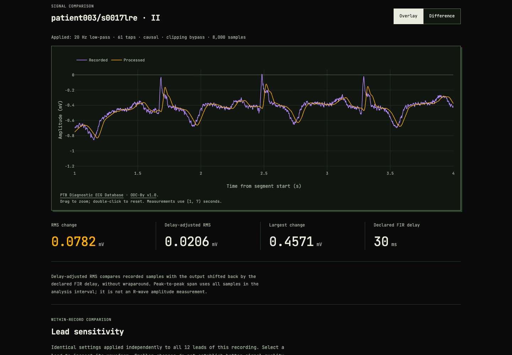
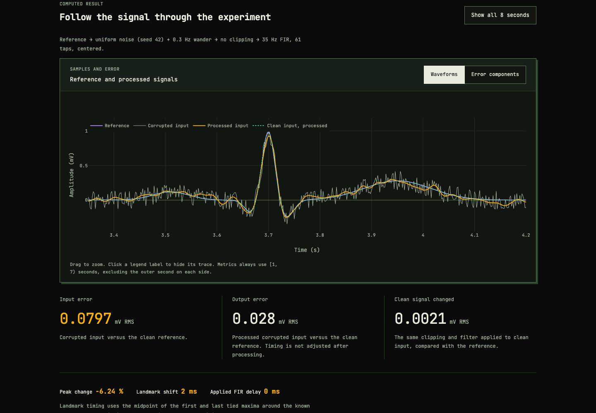

# ECG Failure Atlas

**A biocomputing project for reproducible ECG processing analysis.**

Analyse open hospital recordings alongside controlled synthetic references. Measure processing changes across ECG leads, compare filter settings and replay exported results independently. Synthetic experiments provide known-reference checks for clipping, timing delay, aliasing, baseline filtering and boundary effects.

Built for **Apple Silicon macOS**, with a static gallery that can be hosted on GitHub Pages. Python generates the prepared cases. The custom page calculates new results in JavaScript and supports independent replay with NumPy/SciPy. A separate clinical analysis page uses a pinned subset of the PTB Diagnostic ECG Database. All three pages work without a backend.



## Demo

[Hospital recordings](https://zakimaths.github.io/ecg-failure-atlas/clinical.html) · [Reference experiments](https://zakimaths.github.io/ecg-failure-atlas/) · [Build an experiment](https://zakimaths.github.io/ecg-failure-atlas/lab.html) · [Prepared-case recording](docs/assets/ecg-failure-atlas-demo.mp4)

Open **[gallery/index.html](gallery/index.html)** from your downloaded copy of the repository in a browser. All chart assets and data are included locally. Or serve it from the repository root:

```sh
python3 -m http.server 8765 --bind 127.0.0.1 --directory gallery
```

Visit **http://127.0.0.1:8765**. Choose a case, change one of its three prepared settings, switch between Overlay and Difference, and download the exact result. Links retain the selected case and setting. Use the hosted demo link when sharing a case; `localhost` and `file:` links only work on your machine.

## Hospital recording analysis

The [clinical page](https://zakimaths.github.io/ecg-failure-atlas/clinical.html) includes **three recordings × 12 leads × 8 seconds**, at the original **1,000 Hz** sample rate. These recordings were collected at University Clinic Benjamin Franklin in Berlin and shared by PTB through [PhysioNet](https://physionet.org/content/ptbdb/1.0.0/).

- Record and lead selection, clipping, causal/centered FIR filtering, overlay and difference views.
- RMS change, delay-adjusted RMS, maximum absolute change and peak-to-peak span.
- The same pipeline compared across 12 leads, plus a fixed-input cutoff sweep.
- JSON and attributed CSV downloads, shareable settings and browser/Python replay.

Recorded input is the comparison baseline, **not clean ground truth**. Reduced change does not establish better denoising or clinical performance. The first listed recording from each of the first three subject directories is a convenience subset, not a representative cohort. Clinical summaries and disease labels are not part of the analysis.

```sh
uv run --locked ecg-atlas replay-clinical analysis.json
# Re-fetch pinned source files and reconstruct the exact committed subset:
uv run --locked python scripts/prepare-ptb.py --download --out build/ptb-rebuilt.json
cmp build/ptb-rebuilt.json src/ecg_atlas/data/ptb-subset.json
```

[Clinical methods, source provenance and data licence](docs/clinical-recordings.md).

## Beat-detection sensitivity

Compare beat candidates in the recorded and processed signals using a transparent slope-energy detector with a shared threshold. Inspect waveform markers, detector scores, one-to-one matches, unmatched candidates, raw and delay-adjusted timing shifts, and interval-based rate changes. Threshold, minimum spacing and matching tolerance are adjustable.

[Open detection comparison](https://zakimaths.github.io/ecg-failure-atlas/clinical.html#beat-section). Export the complete detection analysis and replay it independently:

```sh
uv run --locked ecg-atlas replay-beats ecg-detection.json
```

The detector can select a dominant positive or negative deflection. It is not clinically validated, and unmatched candidates are not confirmed false or missed beats. No annotation-based accuracy is claimed. See [the detector method and replay contract](docs/beat-detection.md).

## Batch benchmark

The [batch section](https://zakimaths.github.io/ecg-failure-atlas/clinical.html#batch-section) applies the selected clipping, FIR length and timing to **all 3 recordings × 12 leads**, sweeping 0, 12, 20, 35, 50 and 100 Hz plus the current cutoff. The default protocol produces **216 lead-setting results**.

Compare per-record summaries, filter the individual results by cutoff and open any row as a single-record analysis. JSON and CSV downloads include all cutoffs. Runs can be cancelled; changed settings disable stale exports. Computation stays local and yields between leads to keep the page responsive.

```sh
uv run --locked ecg-atlas run-batch recipes/batch.json --out build/my-batch.json
uv run --locked ecg-atlas replay-batch build/my-batch.json
```

The compact JSON stores protocol, source attribution, coefficients, row-level metrics and per-record summaries. Replay loads the pinned PTB samples and independently recomputes the batch. The 12 leads within each record are related measurements. Summaries are descriptive, not population estimates or filter-quality rankings. See [batch methods](docs/batch-benchmark.md).

## Synthetic processing analysis

The [custom experiment page](https://zakimaths.github.io/ecg-failure-atlas/lab.html) adds:

- Seeded uniform noise and baseline wander, followed by adjustable clipping and low-pass filtering.
- Causal and centered FIR comparisons with explicit timing and boundary assumptions.
- A clean-input processing branch to separate signal distortion from the effect of corruption.
- Magnitude and phase response, plus a cutoff sweep that reuses the exact same input.
- Full JSON and CSV exports, shareable settings, and replay import that rejects altered results.



[Method, equations and limits](docs/custom-experiments.md). The custom JSON has its own replay commands:

```sh
uv run --locked ecg-atlas replay-live experiment.json --mode saved-input
uv run --locked ecg-atlas replay-live experiment.json --mode regenerate
```

## Reproduce on an Apple Silicon Mac

Use a native Terminal session (`uname -m` should print `arm64`). Install [uv](https://docs.astral.sh/uv/getting-started/installation/) if needed; this project was tested with **uv 0.9.17**. A version-specific installer is available:

```sh
curl -LsSf https://astral.sh/uv/0.9.17/install.sh -o /tmp/ecg-uv-install.sh
# Inspect the downloaded installer, then run it:
sh /tmp/ecg-uv-install.sh
```

Restart your terminal if uv is not yet on PATH. From the repository root:

```sh
uv sync --locked
uv run --locked pytest -q
uv run --locked ecg-atlas build recipes/demo.json --out build/my-demo
uv run --locked ecg-atlas verify build/my-demo
uv run --locked ecg-atlas replay build/my-demo --mode saved-input
uv run --locked ecg-atlas replay build/my-demo --mode regenerate
uv run --locked ecg-atlas export-gallery build/my-demo --out build/my-gallery
```

The Python patch is pinned to **3.12.12** in `.python-version`; uv can install it automatically. NumPy, SciPy, Plotly, test dependencies and artifact hashes are in `uv.lock`. First installation needs network access; calculations and gallery viewing work offline afterward.

Use a **fresh output directory** for each build/export. Existing evidence is never overwritten by the CLI. To replay a downloaded ZIP, extract it into a new folder and use that folder instead of `build/my-demo` in the verify/replay commands.

## Optional browser automation

The gallery needs no JavaScript build step. Node is used only for repeatable browser checks and recording. `.node-version` records the tested Node version; `package-lock.json` locks the CLI and its browser engine dependencies.

```sh
npm ci --ignore-scripts
npx --no-install playwright-cli install-browser webkit
npm run check:browser
npm run check:lab
npm run check:clinical
npm run check:batch
npm run check:beats
uv run --locked python scripts/check-live.py
uv run --locked python scripts/check-clinical.py
uv run --locked python scripts/check-beats.py
```

The default check uses installed Chrome and Playwright WebKit. Run `npm run check:browser -- webkit` for WebKit alone. The runner starts and closes its own localhost server, checks all 15 settings against their saved samples and measurements, and writes results/screenshots under `output/playwright/`. It also checks keyboard controls, downloads, clipboard denial, narrow charts and offline viewing. Browser installation needs network access.

Check the shipped gallery's complete evidence chain without a browser:

```sh
uv run --locked python scripts/verify-gallery.py gallery
```

See the verification record for which automated checks have actually completed. To record the scripted demonstration after those checks pass, use `npm run record:demo`.

## The five experiments

| Case | What to inspect | Independent check |
|---|---|---|
| Clipping | Lost peak amplitude and ambiguous plateau timing | Literal expected clipped array |
| Timing delay | Same shape, later landmark | Five samples at 500 Hz = 10 ms; no wraparound |
| Aliasing | 80 Hz input becomes a signed 20 Hz alias | Negative 20 Hz analytic sine; interior FIR suppression |
| Baseline wander | Drift removal also changes the clean signal | Separate clean-input and corrupted-input branches |
| Filter edges | Crop-then-filter differs from filter-then-crop | Explicit boundary windows; analytic forward/backward gain test |

The generator is an original simplified ECG-like waveform, plus a pure sine probe. The project is an engineering demonstration, **not a diagnostic tool or clinically validated benchmark**. There is no disease classifier whose accuracy is being measured.

## Experiment structure

- **Independent implementations:** prepared cases use Python; the bounded custom engine uses browser convolution checked against NumPy/SciPy.
- **15 saved settings:** three per experiment, with fixed axes and full-resolution metrics.
- **Replay bundles:** inputs, outputs, intermediate branches, events, configuration, coefficients, metrics, environment and SHA-256 checksums.
- **Separate checks:** payload integrity, saved-input recalculation, and full regeneration. A checksum is not proof of scientific correctness or authorship.
- **Source provenance:** Python source fingerprint and git revision when available. Hosted bundles are rebuilt from the deployed commit. Each download records its source revision and fingerprint.

The static gallery includes the small clinical subset, all 15 synthetic ZIP downloads and the local Plotly bundle. It loads no remote fonts or application services. No framework or runtime service is required.

## Tests and project status

See **[the verification record](docs/verification.md)** for observed results and remaining release checks. The native Mac verification workflow is in `.github/workflows/verify.yml`; a workflow file alone is not a passing GitHub Actions run.

```sh
uv run --locked ruff check src tests
uv run --locked ruff format --check src tests
```

The custom page supports a fixed synthetic reference and a bounded processing pipeline. For broader experiments, extend the Python functions and add independent checks. Patient-data upload, arbitrary processing code, annotation-based detector scoring and Intel support are outside this version.

## Repository guide

- `src/ecg_atlas/`: numeric engine, bundle validation, CLI and gallery source.
- `recipes/demo.json`: the 15 prepared experiments.
- `recipes/custom.json`: settings for the custom experiment engine.
- [Custom experiments](docs/custom-experiments.md): filter response, error decomposition, sweeps and replay.
- `tests/`: independent numeric oracles, replay and export checks.
- `gallery/`: generated static site and self-contained downloads.
- [Methodology](docs/methodology.md), [reproducibility](docs/reproducibility.md), [sources](docs/sources.md).
- [Publication guide](docs/publishing.md): GitHub Pages preparation and a short demo story.
- [Design reference](DESIGN.md): typography, colours and responsive layout.

Original code and engineering fixtures are MIT licensed. Bundled chart code retains its own licence; see [third-party notices](THIRD_PARTY_NOTICES.md). The PTB clinical subset is under **ODC-By v1.0**, separately from the MIT code. Its attribution and licence accompany the page and exports. No ECGSYN source or PTB-XL recordings are included.
